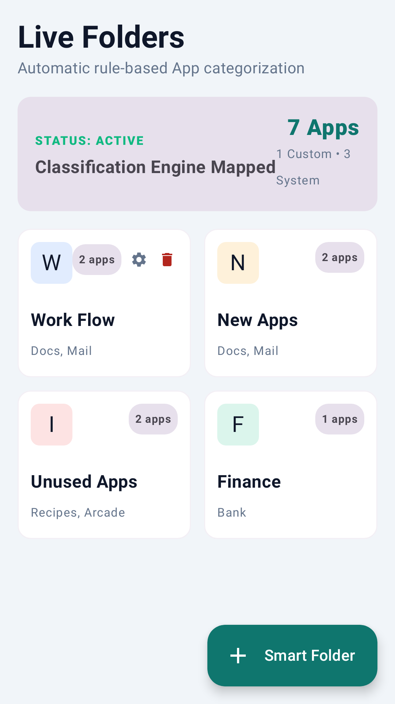
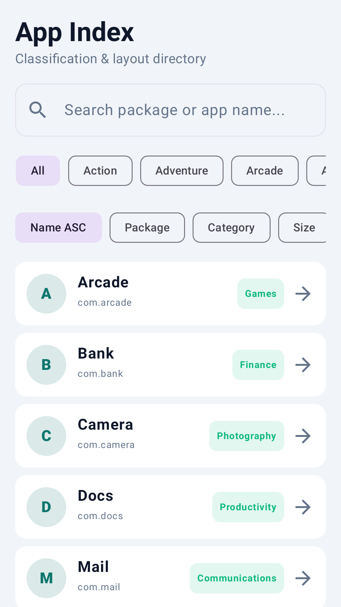
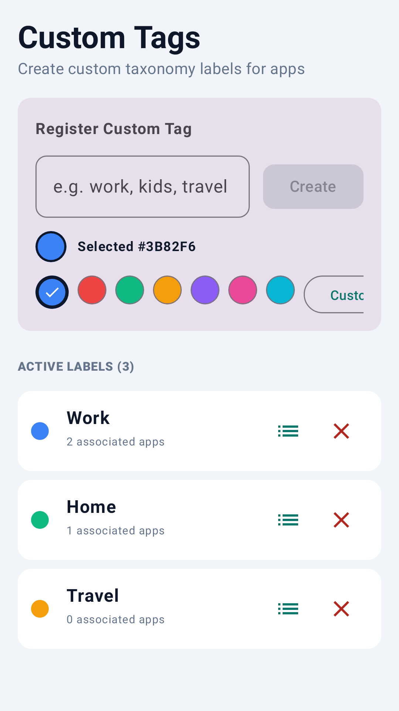
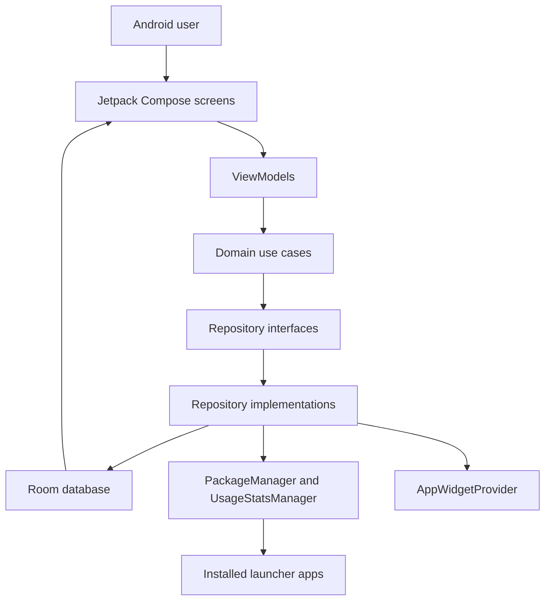

# FolderFlow


[](https://github.com/michaelsam94/FolderFlow/issues)
[](https://github.com/michaelsam94/FolderFlow/commits)

## Project Overview

FolderFlow is an Android app for turning a crowded app drawer into smart, reviewable groups. It scans installed launcher
apps, classifies them into Play Store-style categories, lets users add custom tags, and highlights apps that have been
idle for a chosen threshold.

The project is aimed at Android users who want local-first app organization and lightweight cleanup without account setup.
There is no hosted demo configured; Play Store screenshots are available in [`play-store/`](play-store/).

<table>
  <tr>
    <td></td>
    <td></td>
    <td></td>
  </tr>
</table>

## Key Features

- 📁 Smart folders group apps by category, custom tags, recent installs, or unused-app rules.
- 🔎 App Index provides a searchable view of installed launcher apps with category and sorting tools.
- 🏷️ Color-coded tags let users create personal groupings across categories.
- 💤 Idle Scanner surfaces apps that have not been opened past a selected threshold.
- 🧩 Home-screen widget support exposes folder content outside the main app.
- 🛡️ Local Room storage keeps folder rules, category overrides, and tags on the device.
- 🖼️ Roborazzi tests generate Play Store screenshots, app icon, and feature graphics.

## Architecture Overview



The app follows a small clean-architecture shape: Compose screens own rendering, ViewModels expose screen state, domain
use cases express actions, repository interfaces hide storage details, and Room persists app metadata, folders, rules,
tags, and app-tag relationships. Package scans flow from Android `PackageManager` into `AppRepositoryImpl`, usage data is
optionally read from `UsageStatsManager`, and folder membership is derived from rule matching rather than duplicated data.

## Tech Stack & Libraries

| Layer | Technology | Version | Purpose |
| --- | --- | --- | --- |
| Language | Kotlin | 2.2.10 | App implementation and Gradle Kotlin DSL |
| Build | Android Gradle Plugin | 9.1.1 | Android application builds |
| Build | Gradle Wrapper | 9.5.1 | Reproducible local builds |
| UI | Jetpack Compose BOM | 2024.09.00 | Declarative UI toolkit |
| UI | Material 3 | BOM-managed | App theme and components |
| Navigation | Navigation Compose | 2.8.9 | Bottom navigation and detail routes |
| Persistence | Room | 2.7.0 | Local SQLite persistence |
| Async | Kotlin Coroutines | 1.10.2 | Background scans and reactive flows |
| Images | Coil Compose | 2.7.0 | Compose image loading support |
| Serialization | Moshi | 1.15.2 | JSON model support where needed |
| Networking | Retrofit / OkHttp | 2.12.0 / 4.10.0 | Available dependencies; no public API currently used |
| Testing | JUnit / Robolectric | 4.13.2 / 4.16.1 | JVM and Android framework tests |
| Screenshots | Roborazzi | 1.59.0 | Play Store screenshot and graphic generation |
| Config | Secrets Gradle Plugin | 2.0.1 | `.env` loading into Android build config |

## Prerequisites

- macOS, Linux, or Windows with Android Studio installed.
- JDK 17 or newer for modern Android Gradle Plugin builds.
- Android SDK with compile SDK 36 / target SDK 36 installed.
- Android emulator or physical Android device running API 24 or newer.
- Optional: Google Play Console and Netlify accounts for release listing and privacy-policy deployment.

| Variable | Required | Default | Description |
| --- | --- | --- | --- |
| `GEMINI_API_KEY` | No | `MY_GEMINI_API_KEY` in `.env.example` | Loaded by the Secrets plugin; current app code does not call Gemini. |
| `KEYSTORE_PATH` | Release only | `my-upload-key.jks` | Override path for the release signing keystore. |
| `STORE_PASSWORD` | Release only | Not configured | Release keystore password. |
| `KEY_ALIAS` | Release only | `upload` | Release key alias. |
| `KEY_PASSWORD` | Release only | Not configured | Release key password. |

## Installation & Setup

1. Clone the repository.

   ```bash
   git clone https://github.com/michaelsam94/FolderFlow.git
   cd FolderFlow
   ```

2. Create a local `.env` file from the sample.

   ```bash
   cp .env.example .env
   ```

3. Open the project in Android Studio or use the Gradle wrapper directly.

   ```bash
   ./gradlew :app:assembleDebug
   ```

4. Install a debug build on a connected device or emulator.

   ```bash
   ./gradlew :app:installDebug
   ```

5. Grant usage-access permission on the device if you want more accurate idle-app detection. Without it, FolderFlow still
   scans launcher apps and falls back to install or stored timestamps.

## Configuration

Primary configuration lives in these files:

| File | Purpose | Restart required |
| --- | --- | --- |
| `app/build.gradle.kts` | Android namespace, SDK levels, signing, tests, dependencies, and Roborazzi task wiring | Yes |
| `gradle/libs.versions.toml` | Centralized dependency and plugin versions | Yes |
| `.env` | Local secrets consumed by the Secrets Gradle Plugin | Rebuild required |
| `key.properties` | Optional release signing values | Rebuild required |
| `app/src/main/AndroidManifest.xml` | Permissions, main activity, package-update receiver, and widget receiver | Reinstall required |

Release signing is configured in Gradle, but release credentials should be provided locally through environment variables
or `key.properties`; do not commit private signing material.

## Usage / Quick Start

Build and run the debug app:

```bash
./gradlew :app:assembleDebug
./gradlew :app:installDebug
```

Generate Play Store assets from the screenshot tests:

```bash
./gradlew generatePlayStoreAssets
```

Preview the privacy policy site from the sibling workspace, if present:

```bash
cd ../FolderFlow-pv
python3 -m http.server 8080 --directory .
```

## API Reference

Not applicable. FolderFlow is a local Android app and does not expose an HTTP API, CLI API, or public SDK. Retrofit and
OkHttp are present as dependencies, but the inspected source does not define network service endpoints.

## Project Structure

```text
.
├── app/
│   ├── build.gradle.kts                  # Android application module configuration
│   └── src/
│       ├── main/
│       │   ├── AndroidManifest.xml        # Permissions, activities, receivers, widget metadata
│       │   ├── java/com/michael/folderflow/
│       │   │   ├── core/                  # Data, domain, DI, and presentation helpers
│       │   │   ├── feature/               # Folders, organizer, tags, unused apps, widget UI
│       │   │   └── ui/theme/              # Compose theme definitions
│       │   └── res/                       # App resources and widget layouts
│       ├── test/                          # JVM, Robolectric, domain, DAO, and screenshot tests
│       └── androidTest/                   # Instrumented Android tests
├── gradle/
│   ├── libs.versions.toml                 # Version catalog
│   └── wrapper/                           # Gradle wrapper files
├── play-store/                            # Generated listing graphics and listing copy
├── build.gradle.kts                       # Root Gradle plugin declarations
├── settings.gradle.kts                    # Repositories, toolchains, and modules
└── .env.example                           # Example local secrets file
```

## Testing

Run the standard JVM test suite:

```bash
./gradlew :app:testDebugUnitTest
```

Run connected Android tests on an emulator or device:

```bash
./gradlew :app:connectedDebugAndroidTest
```

Run screenshot recording for Play Store assets:

```bash
./gradlew generatePlayStoreAssets
```

Tests live under `app/src/test/java/com/michael/folderflow/` and `app/src/androidTest/java/com/michael/folderflow/`.
Current naming uses `*Test.kt` for unit, Robolectric, ViewModel, DAO, domain, Compose interaction, and screenshot tests.
No coverage-report task is configured in the inspected Gradle files.

## Deployment

Android release builds are produced with Gradle:

```bash
./gradlew :app:bundleRelease
```

The repository does not include Docker or docker-compose deployment. Release distribution is expected to happen through
Google Play Console using the generated app bundle and assets under `play-store/`. The privacy-policy site is maintained
in the sibling `FolderFlow-pv/` project and can be deployed to Netlify with publish directory `.` and no build command.

Health checks are not applicable for the Android app. For the privacy-policy site, verify that the deployed Netlify URL
returns the static `index.html` and that Google Play Console references that URL.

## Contributing

1. Fork the repository and create a branch named `feature/<short-description>` or `fix/<short-description>`.
2. Use Conventional Commits such as `feat: add folder filter chips` or `fix: preserve custom category on rescan`.
3. Run `./gradlew :app:testDebugUnitTest` before opening a pull request.
4. Include screenshots or Roborazzi updates when changing visible UI or Play Store imagery.
5. Keep Gradle version changes in `gradle/libs.versions.toml` unless the wrapper itself is being upgraded.

There is no `docs/CONTRIBUTING.md` file configured yet. Until one exists, use this section as the contribution checklist.

## Roadmap

- [ ] Add a dedicated contribution guide under `docs/CONTRIBUTING.md`.
- [ ] Add automated coverage reporting for JVM tests.
- [ ] Add migration-safe Room schema export and migration tests before increasing the database version.
- [ ] Add CI for Gradle tests and release-bundle validation.
- [ ] Add in-app onboarding for usage-access permission and idle-app detection behavior.

## License

Not configured. No license file was found in the repository, so all rights are reserved by default unless the project owner
adds a license.

Copyright (c) 2026 Michael.

## Acknowledgements & Credits

FolderFlow is built with Android, Kotlin, Jetpack Compose, Material 3, Room, Navigation Compose, Coroutines, Coil,
Robolectric, and Roborazzi. The generated Google Play graphics and listing copy live in `play-store/`, and the companion
privacy-policy site is maintained in `../FolderFlow-pv/`.
